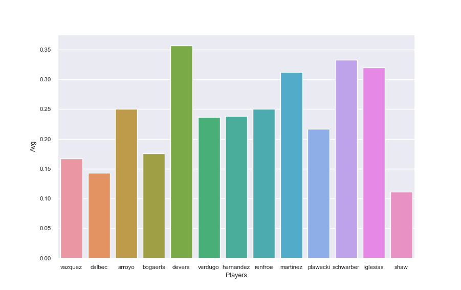
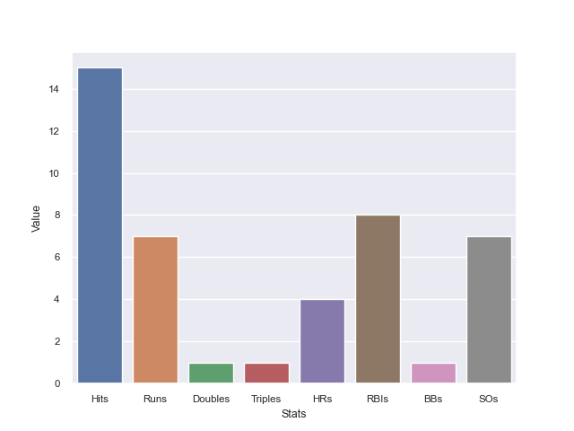

# Streak-Finder
I started this project out of a passion for baseball and baseball statistics. Baseball is one of the most analytically driven competitive sports currently played and new innovations are constantly being employed by teams to gain whatever edge they can over their opponents. 

My main inspiration for creating this project was an infographic that NESN uses in their broadcasts of Red Sox games. The graphic that they use highlights a player from each team before the games starts and it indicates whether those players are on a hot or a cold streak. It also lists their stats from the past few games. The graphic is then brought up again once the game is almost over to show how the two players performed during the game.

My goal is to take that idea and broaden it by finding a player’s best streaks through an entire season. From there I have any number of directions to take the project in.

This project introduced me to web scraping, PostgreSQL, and graph creation via seaborn for the first time. Additionally, it helped me build on my numpy and pandas knowledge.

## Current State 
Currently, the project is capable of scraping the season stats of a team of mlb players. It can then find the batting average of each of those players over the last 10 games each of them has played. Then it can take the player with the highest batting average over their last 10 games and aggregate their stats from those games. Finally a graph is created to show the batting averages and the stats from the player with the highest batting average.

## Graphs
These graphs were created using seaborn and stats saved in a PostgreSQL database that were scrapped from baseball-reference.com.

**Batting averages over last 10 games played.**

**Batting stats over last 10 games for Rafael Devers who had the highest batting average over the last 10 games.**

## Disclaimer
This project is very much a work in progress. This version of the project does not contain the main streak finding algorithm, it only contains a foundation that I can use to build the project up on.
